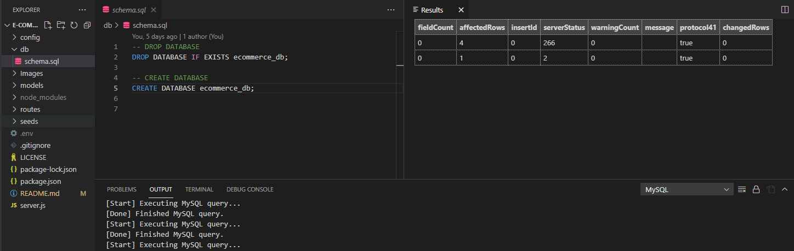
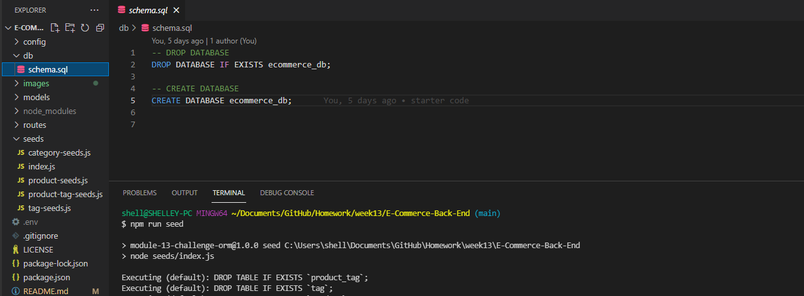
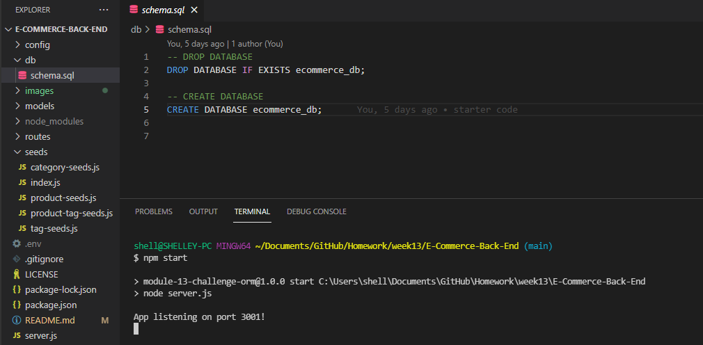
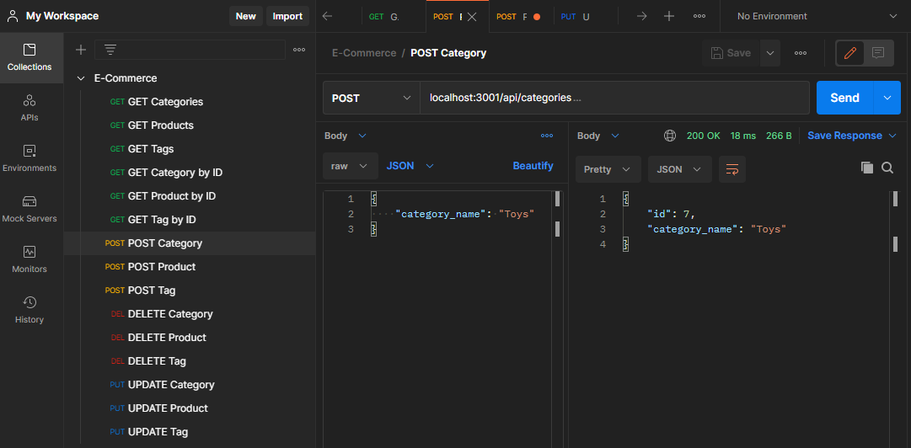

 
# E-Commerce-Back-End
## Licensing:

## Description
This back end for an e-commerce site was built by modifying starter code. The app allows a user to connect to a databse using Sequelize, create and seed a development database, start the server, sync the Sequelize models to the MySQL database.
## Table of Contents
* [Installation](#Installation)
* [Usage](#Usage)
* [Contributors](#Contributors)
* [Future Considerations](#Future)
* [Questions](#Questions)
## Installation
Fork this repo and download the files to your local environment. Install the dependencies and create a .env file.
## Usage
1. Create the schema from the MySQL shell.

2. Seed the database with the command 'npm run seed'.

3. Start the application's server with the command 'npm start'.

4. Use Postman or similar to test GET, POST, PUT, and DELETE routes.

## Contributors
To contribute, please email me at the address below.
## Future Considerations
There is a bug in the code for updating Category and Tag that still needs to be fixed.
## Questions 
https://github.com/shelleymcq or email me at shelleymcq.dev@gmail.com
